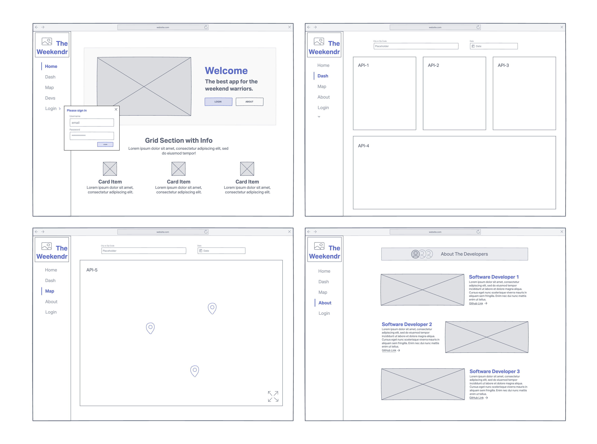
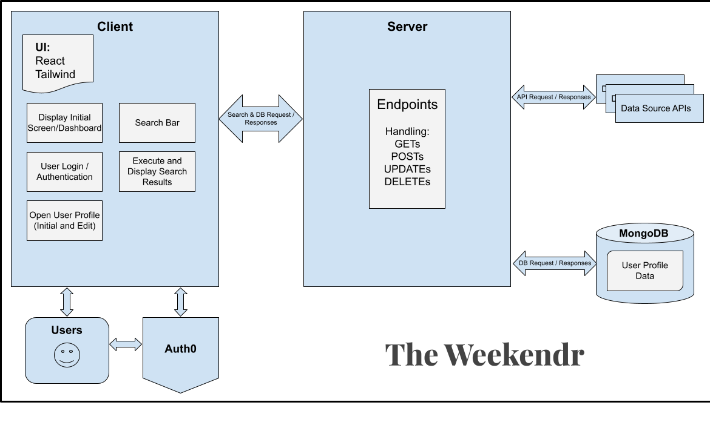
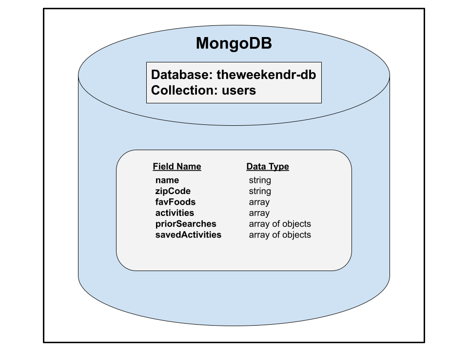

  

# ||  Intermediate Software Development - Group Project ||

# The Weekendr

*Code 301 Final Project - The Weekendr React App*

---

## Group Members

- Dustin Apodaca
- Chris Fanucchi
- Mathew Torres

___

- The vision is to create an user interface that enables the user, given a date and location, to query multiple external databases and find event information.

---

## Wireframe

## User Stories

1. Title: The Weekendr

2. User Story Sentences:

    - As a user, I want the ability to search for events happening in a particular area by querying a city and date range.

    - As a user, I want the ability to search for highly rated restaurants in a particular area by querying a city and date range.

    - As a user, I want the ability to view a weather forecast in a particular area by querying a city and date range.

    - As a user, I want the ability to view movie theater showtime information in a particular area by querying a city and date range.

    - As a user, I want the ability to add events to a localized itinerary within the app. (Stretch)

    - As a user, I want the ability to sync events to my google or iCal calendar. (Stretch)

3. Feature Tasks:

    - User can query results from multiple API's all at once.

    - User can create an account to login.

4. Acceptance Test:

    - 

---

## Domain Modeling

---
